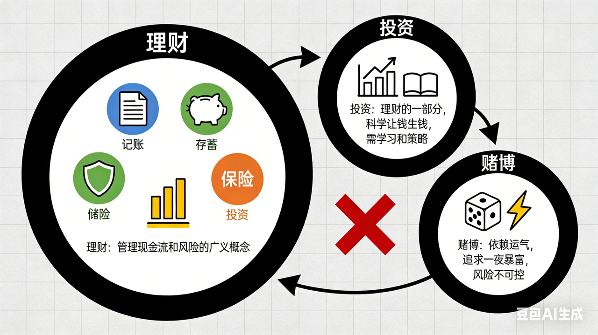
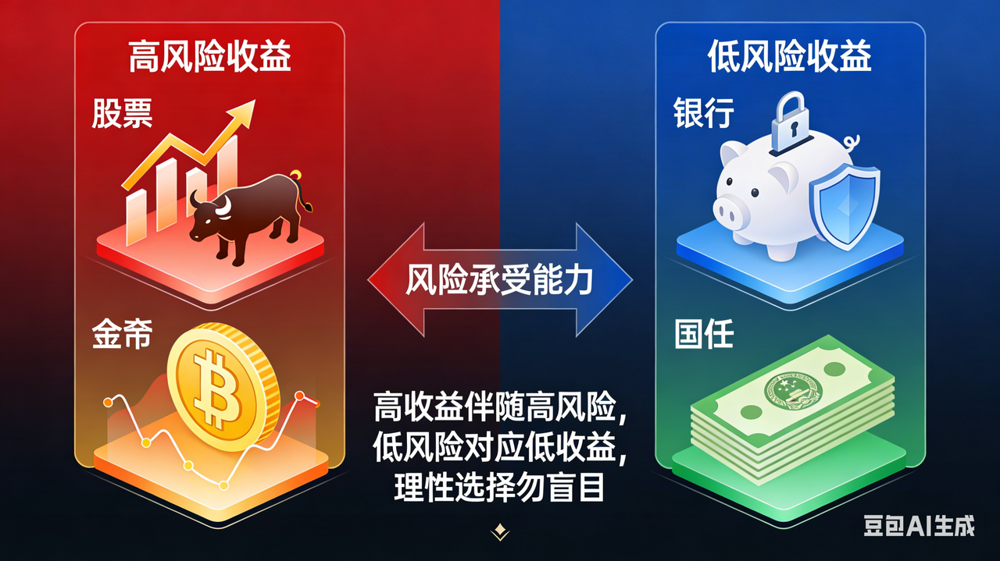
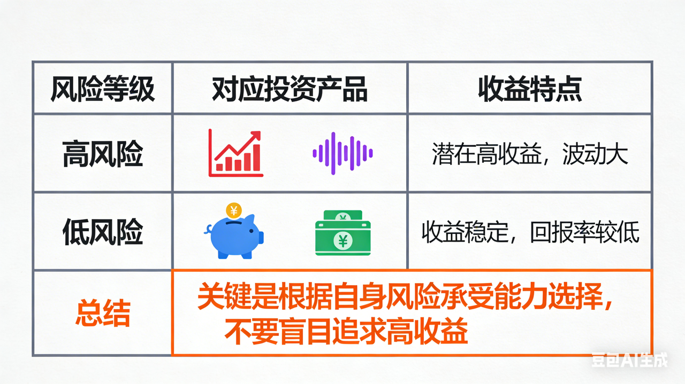
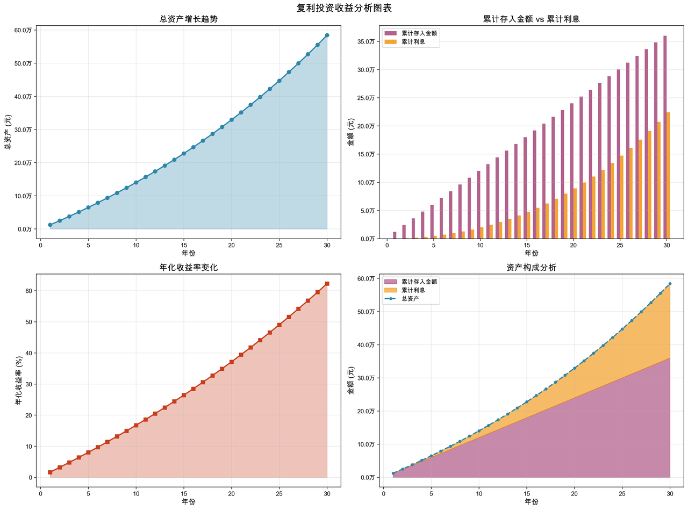
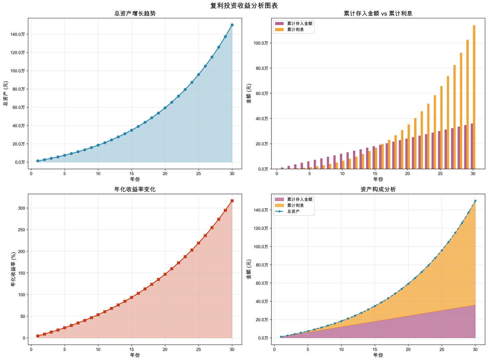

#### **第一部分：投资前必须建立的3个核心观念**

1. **投资 vs. 理财 vs. 赌博**

   * **理财**：更广义，包括记账、储蓄、保险、投资等，目的是管理现金流和风险。

   * **投资**：理财的一部分，是让钱生钱的**科学过程**，需要学习和策略。

   * **赌博**：依赖运气、追求一夜暴富，风险不可控。**投资是长期计划，不是赌博**。

2. **风险与收益的永恒法则**

   * **高收益必然伴随高风险**（如股票、加密货币）。

   * **低风险通常收益较低**（如银行存款、国债）。

   * **关键：** 根据自身风险承受能力选择，不要盲目追求高收益。

3. **时间是你的最强盟友**

   * **复利效应**：利滚利，越早开始，时间带来的增值越惊人。

   * **举例**：每月定投1000元，年化收益8%，30年后可达约150万元。

   * **耐心和纪律**比短期“择时”更重要。

[复利计算结果\_每月存1000元\_年化利率3%\_30年.xlsx](files/复利计算结果_每月存1000元_年化利率3%_30年.xlsx)

[复利计算结果\_每月存1000元\_年化利率8%\_30年.xlsx](files/复利计算结果_每月存1000元_年化利率8%_30年.xlsx)

***

#### **第二部分：了解常见的投资工具（从易到难）**

| 工具类型                | 风险等级 | 潜在收益         | 适合人群     | 一句话理解                      |
| ------------------- | ---- | ------------ | -------- | -------------------------- |
| **银行存款/货币基金**（余额宝等） | 极低   | 低（1%-3%）     | 绝对保守型    | 几乎无风险，随存随取，跑不赢通胀但安全。       |
| **国债/国债逆回购**        | 低    | 较低（2%-4%）    | 保守型      | 国家借钱，信用极高，适合短期闲置资金。        |
| **银行理财/保险理财**       | 低-中  | 中等（3%-5%）    | 稳健型      | 收益略高于存款，注意区分保本与非保本。        |
| **债券基金**            | 中低   | 中等（3%-6%）    | 稳健型      | 一篮子债券，波动小于股票，收益较稳定。        |
| **指数基金/ETF**        | 中高   | 较高（长期8%-10%） | **新手首选** | 打包一篮子股票（如沪深300），分散风险，长期上涨。 |
| **股票**              | 高    | 高（波动大）       | 有一定研究能力者 | 买入公司股权，收益不确定性大，需深入研究。      |
| **加密货币/NFT等**       | 极高   | 极高（波动极大）     | 高风险偏好者   | **不建议新手接触**，属高风险投机。        |

* 比如把资产配置比作足球队（前锋=股票、中场=基金、后卫=债券、守门员=存款）。

* **看你的目标**：如果你打算5年后买房，侧重稳健组合；如果只是长期增值，侧重指数定投。

***

#### **第三部分：新手三步走行动指南**

1. **第一步：梳理财务状况**

   * **记账**：了解每月收入、支出、结余。

   * **设定目标**：短期（1年内，如旅行）、中期（1-5年，如买车）、长期（5年以上，如买房、养老）。

   * **预留应急金**：存够3-6个月生活费，放货币基金，任何投资前先做好这一步。

2. **第二步：测试风险承受能力**

   * **自问**：如果投资亏损20%，会失眠吗？能接受多久不赚钱？

   * **参考风险测评问卷**（券商、银行App都有）。

   * **匹配产品**：

     * 保守型→货基/债基；

     * 稳健型→指数基金+债基组合；

     * 进取型→增加股票基金比例。

3) **第三步：从“极简投资”开始实践**

   * **建议起点**：**指数基金定投**。

     * **为什么**：分散风险、费率低、长期向上、无需选股。

     * **怎么投**：选择沪深300、中证500等宽基指数，每月固定日期投入固定金额（如每月1000元）。

     * **心态**：涨跌都坚持，长期持有（至少3-5年）。

***

#### **第四部分：一定要避开的常见误区**

1. **盲目跟风**：不追热点、不轻信“大神推荐”，理解后再投资。

2. **all in（全仓押注/梭哈）**：永远不要把所有钱投入高风险资产。

3) **频繁交易**：手续费侵蚀收益，普通人很难靠短线赚钱。

4) **追求完美时机**：没有人能永远买在最低点、卖在最高点，定期投入更可行。

5. **忽略通胀**：只存钱不投资，财富实际会缩水（通胀年均约2%-3%）。

***

#### **第五部分：学习资源推荐**

* **书籍**：《小狗钱钱》《富爸爸穷爸爸》（启蒙）、《指数基金投资指南》（实战）。

* **视频**：B站/YouTube科普视频（搜索“基金定投入门”）。

* **工具**：且慢、天天基金网（查数据）、蛋卷基金（跟投组合）。

* **谨防**：付费荐股、承诺保本高收益的群，多是骗局。

***

**动手操作**：用支付宝或天天基金App看一只指数基金的历史走势，并演示如何定投100元体验。

**强调风险**：永远说“可能亏损”，避免产生不切实际的预期。

**最后提醒：** 投资是持续学习的过程，起步不怕慢，关键是开始并坚持。最好的投资时间是十年前，其次是现在。

